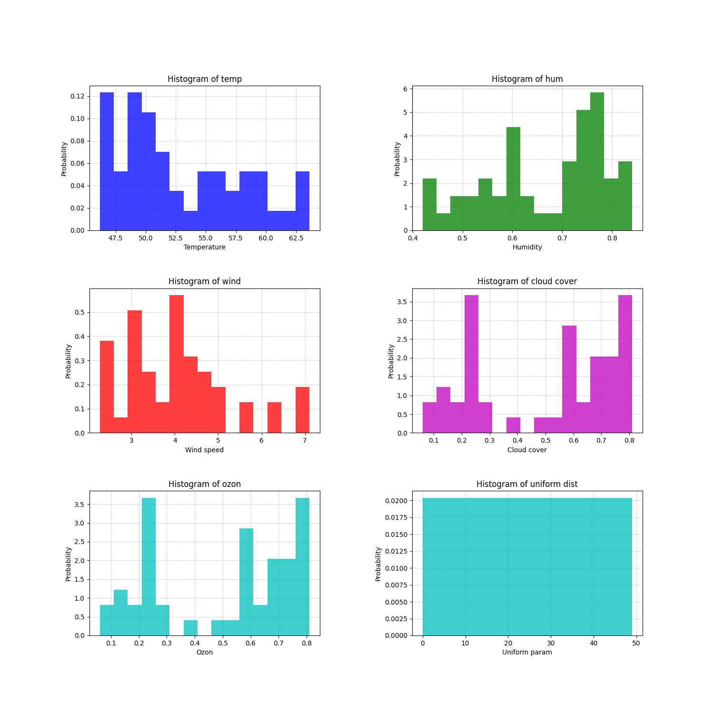
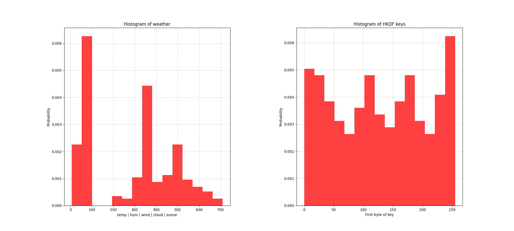
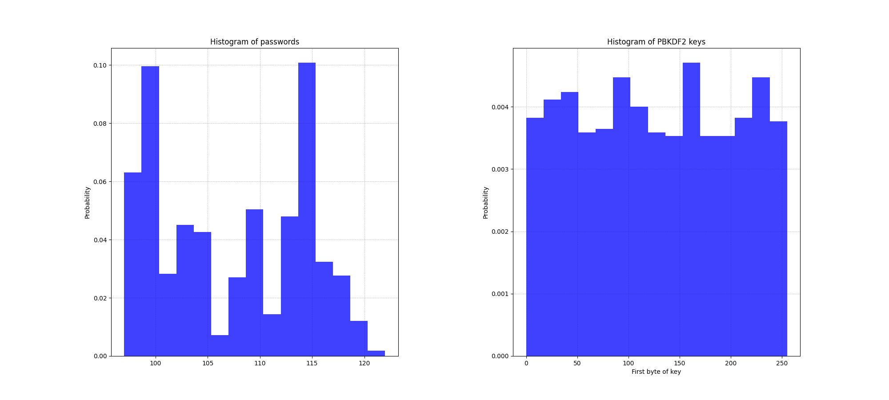

# HKDF and friends
## HKDF
Описание алгоритма: [RFC 5869](https://datatracker.ietf.org/doc/html/rfc5869)

Интерфейс реализованного класса:
```py
class HKDF():
    def __init__(self, salt, IKM, info, L)

    def __extract(self):        # HKDF-Extract(salt, IKM) -> PRK
    def __expand(self, PRK):    # HKDF-Expand(PRK, info, L) -> OKM

    def calculate(self):
```
## PBKDF2
Описание алгоритма: [RFC 2898](https://www.ietf.org/rfc/rfc2898.txt)

Интерфейс реализованного класса:
```py
class PBKDF2():
    def __init__(self, P, S, c, dkLen)

    @property
    def P(self)
    @P.setter
    def P(self, P)

    def __F(self, i)        # F(P, S, c, i) = U_1 \xor U_2 \xor ... \xor U_c

    def calculate(self)
```

# Результаты работы
## Гистограммы погодных характеристик(Температура | Влажность| Скорость ветра | Обачность | Озоновый слой)


## Гистограмма HKDF
В качестве IKM был взят массив из всех погодных характеристик(его гистограмма слева):


## Гистограмма PBKDF2
